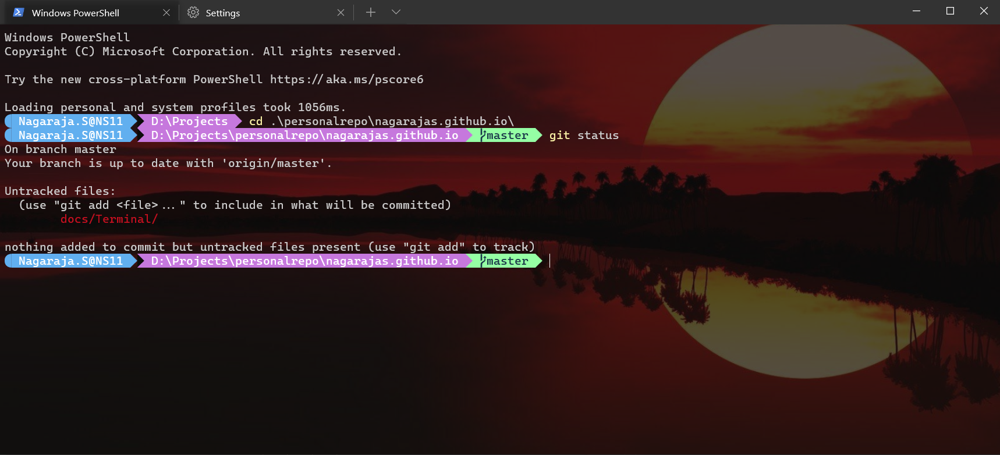

# Customize windows terminal 
Undoubtedly, usage of terminal has increased in the modern software development. However, the default ones are boring. Hence, I recently attempted to customize it and I got thrilled with the outcome. Anyway, before I brief you about the steps, check out the outcome.

>**Imp**, install [Windows Terminal](https://www.microsoft.com/en-usp/windows-terminal/9n0dx20hk701?WT.mc_id=thomasmaurer-blog-thmaure#activetab=pivot:overviewtab)

1. Open windows terminal
2. Open settings (win+, )
3. Open setting JSON file in VS Code
4. [optional] To add transparency, modify the default "profile" property  

    

        "profiles": 
        {
            "defaults": 
            {
                "acrylicOpacity": 0.1,            
                "useAcrylic": true
            }            
        .....
        
    

5. [optional] To set background image 

        "profiles": 
        {
            "defaults": 
            {
                "backgroundImage": "C:\\sunset1.jpg",
                "backgroundImageAlignment": "center",
                "backgroundImageOpacity": 0.3,
                "backgroundImageStretchMode": "uniformToFill"            
            }            
        .....

6. To customize the prompt, I used ["oh my posh"](https://ohmyposh.dev/). 

7. To render fonts appropriately, download and install [Cascadia code font](https://github.com/microsoft/cascadia-code/releases). Most importantly we need to install “CascadiaCodePL” font. Post installation, set "fontface" property in default profile. 

    <code>

        "profiles": 
                {
                    "defaults": 
                    {
                        "backgroundImage": "C:\\sunset1.jpg",
                        "backgroundImageAlignment": "center",
                        "backgroundImageOpacity": 0.3,
                        "backgroundImageStretchMode": "uniformToFill",
                        "fontFace": "Cascadia Code PL"      
                    }            
                .....
    </code>

That's all, hope it helps

    
        

